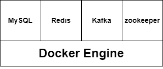

# 선착순 이벤트 시스템

## 1. 개요

### 사용 기슬

- Java
- Spring Boot
- Spring Data JPA
- Redis
- Apache Kafka
- MySQL
- Docker

### 설명

- 선착순으로 쿠폰을 발급하는 이벤트 시스템
- 선착순 이벤트 시스템을 단계적으로 만들어 나가면서, 각 단계에서 어떠한 문제점이 발생하고 이를 어떻게 해결하는지를 학습
- Docker 환경에서 Redis, Kafka를 구성하며 프로젝트에서 주로 사용하는 명령어를 실습

### 요구사항 정의

선착순 100명에게 할인쿠폰을 제공하는 이벤트를 진행하고자 한다.

이 이벤트는 아래와 같은 조건을 만족하여야 한다.
- 선착순 100명에게만 지급되어야한다.
- 101개 이상이 지급되면 안된다.
- 순간적으로 몰리는 트래픽을 버틸 수 있어야합니다.

### 참고 강의

- [실습으로 배우는 선착순 이벤트 시스템 - 최상용](https://www.inflearn.com/course/%EC%84%A0%EC%B0%A9%EC%88%9C-%EC%9D%B4%EB%B2%A4%ED%8A%B8-%EC%8B%9C%EC%8A%A4%ED%85%9C-%EC%8B%A4%EC%8A%B5#)

---

## 2. 100개의 선착순 쿠폰 발급 흐름

### Kafka Producer (api)

1. Client에서 동시에 1000번의 쿠폰 발급 Request
2. Redis에서 Key가 applied_user인 Set 자료구조에서 해당 userId(value)가 존재하는지 확인(존재한다면 이미 쿠폰을 발급받은 상태)
  - 발급을 받은 상태(0) : 쿠폰 발급 차단
	- 발급을 받지 않은 상태(1) : 다음 로직 수행
3. Redis -> "coupon_count"의 count 증가시킴
	- 시스템에서 쿠폰을 한개 발급시켜준 상태
	- 쿠폰 발급 갯수가 100 초과라면 발급 중지
	- 그 이하라면 다음 로직 수행
4. Kafka Producer를 통해 Topic(coupon_create)으로 데이터 전송
	- send("coupon_create", userId)

### Kafka Consumer (consumer)

- KafkaListener
	- topic: "coupon_create", groupId: "group_1"
	- topic에서 userId를 가져와서 DB(coupon)에 저장
	- 실패한 요청은 DB(failed_event)에 저장
	- 실패한 객체들은 배치 프로그램을 통해 추후 일괄 처리

---

## 3. 구조

### Docker Container



### 프로젝트

```shell
coupon-system
│  .gitignore
│  build.gradle
│  docker-compose.yml
│  gradlew
│  gradlew.bat
│  README.md
│  settings.gradle
├─.gradle ...
├─.idea ...
│
├─api
│  │  .gitignore
│  │  build.gradle
│  │  gradlew
│  │  gradlew.bat
│  │  settings.gradle
│  ├─.gradle ...
│  ├─build ...
│  ├─gradle ...
│  │
│  └─src
│      ├─main
│      │  ├─java
│      │  │  └─com
│      │  │      └─example
│      │  │          └─api
│      │  │              │  ApiApplication.java
│      │  │              ├─config
│      │  │              │      KafkaProducerConfig.java
│      │  │              ├─domain
│      │  │              │      Coupon.java
│      │  │              ├─producer
│      │  │              │      CouponCreateProducer.java
│      │  │              ├─repository
│      │  │              │      AppliedUserRepository.java
│      │  │              │      CouponCountRepository.java
│      │  │              │      CouponRepository.java
│      │  │              └─service
│      │  │                      ApplyService.java
│      │  │
│      │  └─resources
│      │          application.yml
│      │
│      └─test
│          └─java
│              └─com
│                  └─example
│                      └─api
│                          │  ApiApplicationTests.java
│                          └─service
│                                  ApplyServiceTest.java
│
├─consumer
│  │  .gitignore
│  │  build.gradle
│  │  consumer.iml
│  │  gradlew
│  │  gradlew.bat
│  │  settings.gradle
│  ├─.gradle ...
│  ├─build ...
│  ├─gradle ...
│  │
│  └─src
│      ├─main
│      │  ├─java
│      │  │  └─com
│      │  │      └─example
│      │  │          └─consumer
│      │  │              │  ConsumerApplication.java
│      │  │              ├─comsumer
│      │  │              │      CouponCreatedConsumer.java
│      │  │              ├─config
│      │  │              │      KafkaConsumerConfig.java
│      │  │              ├─domain
│      │  │              │      Coupon.java
│      │  │              │      FailedEvent.java
│      │  │              └─repository
│      │  │                      CouponRepository.java
│      │  │                      FailedEventRepository.java
│      │  │
│      │  └─resources
│      │          application.yml
│      │
│      └─test
│          └─java
│              └─com
│                  └─example
│                      └─consumer
│                              ConsumerApplicationTests.java
│
└─gradle ...
```
